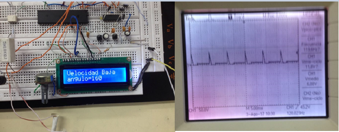
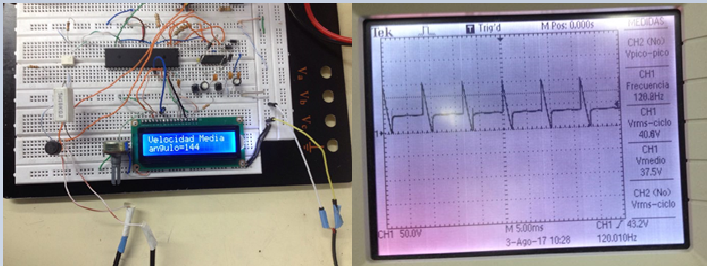
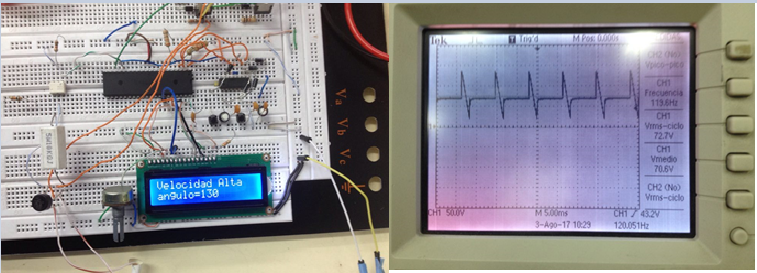

# Bridge Rectifier for speed control
<!-- markdownlint-disable MD033 -->
<!-- markdownlint-disable MD047 -->
## 1. Prerequisites

Have installed on your computer ATMEL Studio.

## 2. Materials used

-DC Motor

-SCR

-Potenciometer

-Atmega164P

-4N25

-Diode Bridge

-MOC3020

-LCD 16X2

-AND Gate

## 3. Description

This project has two operation modes, the first you can set between low, average and high speed and the second you can set the pulse width with buttons.

## 4. Results

In the next figure you can see the configuration with low speed.

  

The next figure you can see the configuration with average speed.

  

Finally this figure shows the configuration with high speed.

  

## 5. Contact with me

Linkedin: <www.linkedin.com/in/juan-balseca-pinto-9117b397>